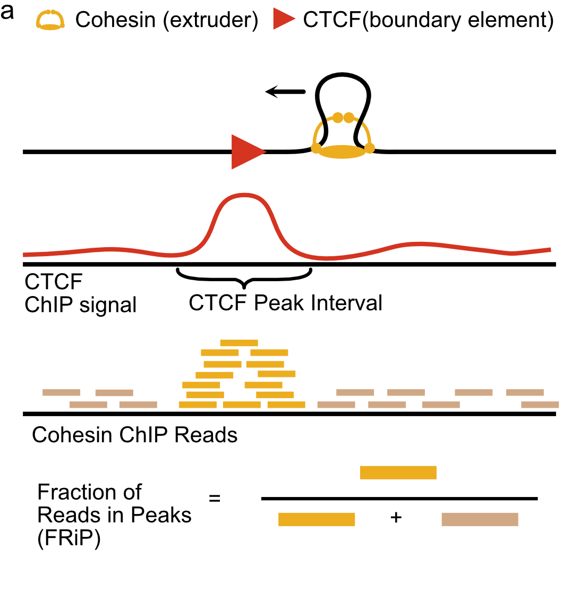
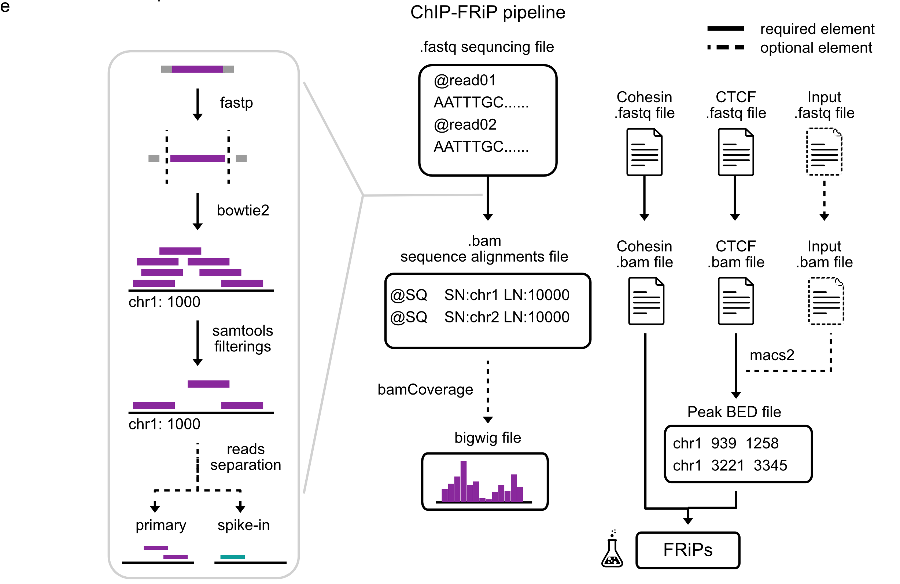
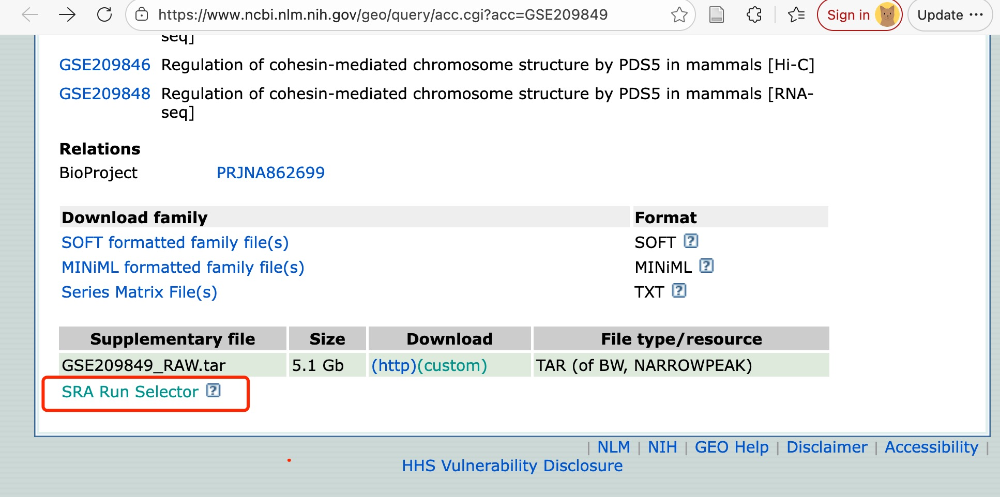
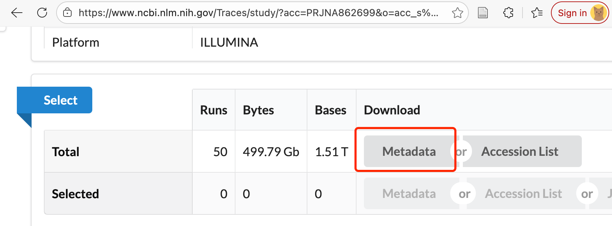

# ChIP-FRiP

## Description
ChIP-FRiP provides a Snakemake pipeline for calculating FRiP ("Fraction of Reads in Peaks") from FASTQ. FRiP is calculated from a BAM (Binary Alignment Map) file and a BED (Browser Extensible Data) file. Publicly-available datasets provide FASTQ files. However, BAM files are often not provided, yet essential for calculating FRiP. The ChIP-FRiP pipeline thus covers: mapping and filtering FASTQ files to generate BAM files (with [Bowtie2](https://github.com/BenLangmead/bowtie2) and [SAMtools](https://github.com/samtools/samtools)) and calling peaks (with [MACS2](https://github.com/macs3-project/MACS)) to generate BED files. 

The ChIP-FRiP pipeline can be used to process ChIP-seq datasets that are:
- spike-in or not spike-in
- single-end or paired-end 
- with input or with no input

This repository additional provides scripts for:
- managing metadata from SRA/GEO (via ffq)
- computing FRiP (via bioframe)

## Figure
&nbsp;


## Prerequisites
- Python

## Installation
```
git clone https://github.com/Fudenberg-Research-Group/ChIP-FRiP.git
cd ChIP-FRiP/ChIP-FRiP
conda env create -f ../env/chip_frip_env.yml -n chip_frip_env
conda activate chip_frip_env
```

*All dependencies mentioned below are included in our conda environment, so you don't need to worry about any further installation :)*

# Walkthrough
Usage of ChIP-FRiP has three stages: (1) preparation of input data and configuration files, (2) running the snakemake workflow to generate BED and BAM files, (3) and generating FRiP tables from these workflow outputs.

## Preparing pipeline input

### Download fastq files from GEO dataset
FASTQ data is available in the Gene Expression Omnibus (GEO). FASTQ is a common format for storing raw sequencing data generated by next-generation sequencing technologies. In GEO, such raw sequencing data are often included as part of the supplementary files associated with a GEO Series (GSE) record. By clicking on the 'SRA Run Selector', users can select and download specific data (e.g., based on organism, gene, condition, or experiment type) from the Sequence Read Archive (SRA) page. For example, for [GSE209849](https://www.ncbi.nlm.nih.gov/geo/query/acc.cgi?acc=GSE209849). 



To quickly access the accession codes for a particular ChIP-seq dataset, click "Metadata" button on the page to download "SraRunTable.txt" **(example SraRunTable.txt is provided in data/ folder)**. 



To extract accession numbers for each file, run:
```
grep "ChIP" ../data/Yu_2022_SraRunTable.txt | awk -F, '{print $1}' > ../data/accessions.txt
```

 `scripts/batch_download.sh`, will download FASTQs listed in 'accessions.txt'. This uses `fasterq-dump` (from `sra-tools`). This script requires 'accession.txt' in the same folder, and can be run as:
```
bash ../scripts/batch_download.sh
```

***Note:*** *we provide data/Yu_2022_ChIP_input_table.txt, which only cotains three example FASTQ files from Yu_2022 for this walkthrough*

#### ChIP & Input table for Peak Calling:
To rescale the bigwig file and call peaks based on an input (control) sample, the pipeline requires a metadata table (in tsv format) with two columns: ChIP and Input. 

<center>

|        ChIP|       Input|
|-----------:|-----------:|
| SRR20664887 | SRR20664892 |
| SRR20664888 | SRR20664892 |
</center>

Sample names should match those in the FASTQ files (e.g., SRR5085155.fastq). Any samples that are not appear on the table will be recognized as samples without input automatically. 

***Note:*** *to proceed with the walkthrough, you will need to generate a ChIP & Input table. However, this is generally optional for datasets that do not provide the input. A Python script for generating such a table is provided: [examples/generate_chip_input_table.ipynb](https://github.com/Fudenberg-Research-Group/ChIP-FRiP/tree/main/examples).*

### Bowtie2 index files
ChIP-FRiP uses [Bowtie2](https://github.com/BenLangmead/bowtie2) for alignment. For many genomes, bowtie2 index files can be obtained from NCBI or the UCSC genome browser. From NCBI, you can choose to use bowtie2 index files directly. Alternatively, download the reference genome to make your own bowtie2 index files.

***Note:*** *For the walkthrough, please download the pre-made combined index for hg38 and mm10.* 
```
mkdir -p ../data/bowtie_index
wget -P ../data/bowtie_index/ https://zenodo.org/records/18705752/files/hg38_mm10.tar.gz
tar -xvzf ../data/bowtie_index/hg38_mm10.tar.gz -C ../data/bowtie_index/
```

<center>

|        Species/File Type|       URL Link|
|-----------:|-----------:|
| hg38/reference genome |  [Link](https://ftp.ncbi.nlm.nih.gov/genomes/all/GCA/000/001/405/GCA_000001405.15_GRCh38/seqs_for_alignment_pipelines.ucsc_ids/GCA_000001405.15_GRCh38_no_alt_analysis_set.fna.gz)|
| mm10/reference genome |  [Link](https://ftp.ncbi.nlm.nih.gov/genomes/all/GCA/000/001/635/GCA_000001635.5_GRCm38.p3/seqs_for_alignment_pipelines.ucsc_ids/GCA_000001635.5_GRCm38.p3_no_alt_analysis_set.fna.gz)|
| hg38/bowtie2 index |  [Link](https://ftp.ncbi.nlm.nih.gov/genomes/all/GCA/000/001/405/GCA_000001405.15_GRCh38/seqs_for_alignment_pipelines.ucsc_ids/GCA_000001405.15_GRCh38_no_alt_analysis_set.fna.bowtie_index.tar.gz)|
| mm10/bowtie2 index |  [Link](https://ftp.ncbi.nlm.nih.gov/genomes/all/GCA/000/001/635/GCA_000001635.5_GRCm38.p3/seqs_for_alignment_pipelines.ucsc_ids/GCA_000001635.5_GRCm38.p3_no_alt_analysis_set.fna.bowtie_index.tar.gz)|
</center>

Most of time, you can use bowtie2 index files directly by running the following command:
```
tar -xvzf GCA_000001405.15_GRCh38_no_alt_analysis_set.fna.bowtie_index.tar.gz
```

For spike-in ChIP-seq, the following creates a combined bowtie index for the two species. For example, for hg38 and mm10:
```
gunzip GCA_000001405.15_GRCh38_no_alt_analysis_set.fna.gz
gunzip GCA_000001635.9_GRCm39_full_analysis_set.fna.gz

sed -i 's/^>/>hg38_/' GCA_000001405.15_GRCh38_no_alt_analysis_set.fna
sed -i 's/^>/>mm10_/' GCA_000001635.9_GRCm39_full_analysis_set.fna

cat GCA_000001405.15_GRCh38_no_alt_analysis_set.fna GCA_000001635.9_GRCm39_full_analysis_set.fna > hg38_mm10.fna
mkdir hg38_mm10
cd hg38_mm10
bowtie2-build ../hg38_mm10.fna hg38_mm10.bowtie_index
```

## The snakefile: Generating BAMs and BEDs

### Modify Configuration file of snakemake
Specify the locations of your input files (FASTQ and Bowtie index files) and output files, and choose whether to include spike-in normalization in the configuration file `config.yml`. Detailed explanations for each parameter are included in config.yml. 
If the experiment includes spike-in, set 'include_spikein' to true, and set 'index_primary' and 'index_spikein' according to the experiment (the name should match that of the bowtie2 index files, e.g. if "hg38" is used for bowtie2 index files, then put "hg38" here as well).


### Run pipeline

Once the configuration file is set up, run the following command in the terminal (you can use "pwd" command line to make sure the current working directory is "ChIP-FRiP/ChIP-FRiP/") to generate the required BAM/BED files:

```
snakemake --use-conda --cores $Ncores --configfile ../config/config.yml
```
Ensure that your computing resources are available.\
  Tips: [Number of cores] = [number of jobs] * [number of process in config.yml]. And, [Number of cores] <= the total number of cpus you have

***Note:*** *ChIP-FRiP uses MACS2 and the default .narrowPeak extension for BED files*

### Pipeline output
| File extension               | Usage |
|-------------------------|----------|
| .narrowPeak | BED file of identified peaks   |
| .<primary_assembly>.sort.bam | **(with spike-in)** alignment file in binary format, which can be used for bigwig generation and peak calling |
| .dedup.bam | **(non spike-in)** this is the alignment file in binary format  |

\
***Note:*** *BAM files can also be used for customized bigwig generation and peak calling.
For example, if you want to analyze a non spike-in sample with customized macs2 parameters:*
```
 macs2 callpeak --broad -t filename.dedup.bam -n output_filename_prefix --outdir output_directory/ --gsize 2652783500 -q 0.05
```

## Computing FRiPs

### Creating metadata table
To create metadata file, modifying `../config/fetch_metadata_config.yml`, and run
```
python fetch_metadata.py config/fetch_metadata_config.yml
```
*Example output metadata table:*

<center>

| Organism      | Celltype | Condition                   | Antibody | Peak_protein | Author_Year   | SRUN         | GSM_Accession | Experiment                      |
|---------------|----------|-----------------------------|----------|-----------|---------------|--------------|---------------|---------------------------------|
| Homo sapiens  | Hepatocarcinoma cells      | PDS5B-dTAG     | RAD21 (Abcam, ab992)  | N/A       | Yu_2022   | SRR20664887  | GSM6402430      |  PDS5B-dTAG_DMSO_RAD21        |
| Homo sapiens  | Hepatocarcinoma cells      |  PDS5B-dTAG     | CTCF (Millipore, 07-729)  | N/A       | Yu_2022   | SRR20664888  | GSM6402429    |  PDS5B-dTAG_DMSO_CTCF        |
</center>

**If you have your own BAM files**, you can also create a metadata table based on the below template. Columns listed below (Condition, Antibody, BAM, and Peak_BED) are mandatory for the pipeline, but more columns can be added as desired. Each row is one sample. If the sample does not have either BAM file or Peak BED file, then just leave the cell blank.
| Condition               | Antibody | BAM          | Peak_BED         |
|-------------------------|----------|--------------|------------------|
| condition of the sample | antibody used in ChIP assay  | pathway to the BAM file of its ChIP-seq| pathway to the peak BED file by calling peaks on this sample|

If all samples use same Peak_BED file/files, then you can ignore this column and input path to peak bed files in `create_frip_table_config.yml`

### Create FRiP table
After generating BAM files and BED files FRiPs can be generated programmatically by modifying the config file `config/create_frip_table_config.yml` , and using `scripts/create_frip_table.py`:

```
python create_frip_table.py config/create_frip_table_config.yml
```
 Example FRiP table:
 
<center>

| FRiP              | Organism      | Celltype | Condition | Antibody | Peak_protein | Author_year   | SRUN       | Peak-SRUN   | Experiment              | FRiP enrichment | #Peaks | Total #basepairs in peaks | Total #reads |
|-------------------|---------------|----------|-----------|----------|----------|---------------|------------|-------------|-------------------------|-----------------|--------|----------------------------|--------------|
| 0.1976738321881107 | Homo sapiens | Hepatocarcinoma cells     | PDS5B-dTAG    | RAD21 (Abcam, ab992)     | CTCF     | Yu_2022 | SRR20664887 | SRR20664882   | PDS5B-dTAG_DMSO_RAD21     | 18.3662977530352 | 44930  | 30354546                   | 12055880     |
| 0.3958324912369793 | Homo sapiens | Hepatocarcinoma cells   | PDS5B-dTAG    | CTCF (Millipore, 07-729)      | CTCF     | Yu_2022 | SRR20664888 | SRR20664882    | PDS5B-dTAG_DMSO_CTCF      | 33.12037790144941 | 44930  | 30354546                   | 7026116     |

</center>

***Note:*** *FRiP can be computed for individual pairs of BEDs/BAMs with the function `utils.calculate_frip`, but can also be generated programmatically as indicated above. utils.py is in the scripts folder*

      
